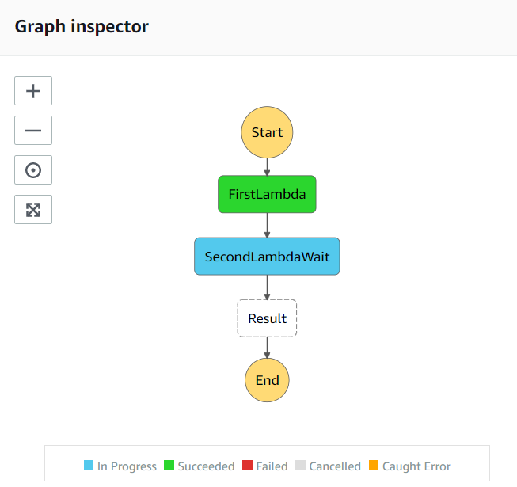
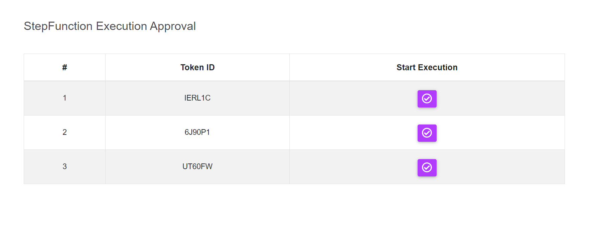

#### Human Approval Manual
StepFunction provide us a feature, manually Start a Running State Machine with human approval i.e.,  there maybe some task which require state machine to `wait` until a task processed completely for further use. For that it provide a constriant `.waitForTaskToken` that wait for token to be returned and it can process to next certain state. Like using a lambda to complete a task,

```
"Resource": "arn:aws:states:::lambda:invoke.waitForTaskToken",
```

Here Step Machine waits until it returns a success response from `sendTaskSuccess` API call.
<center>
  
</center>


<b>Frontend App</b>
<center>
  
</center>
